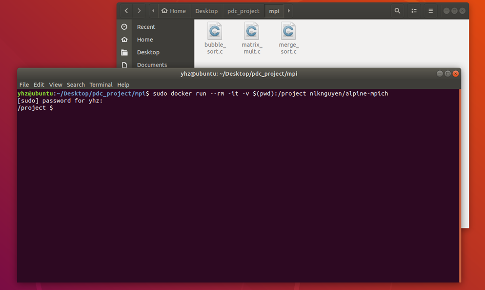
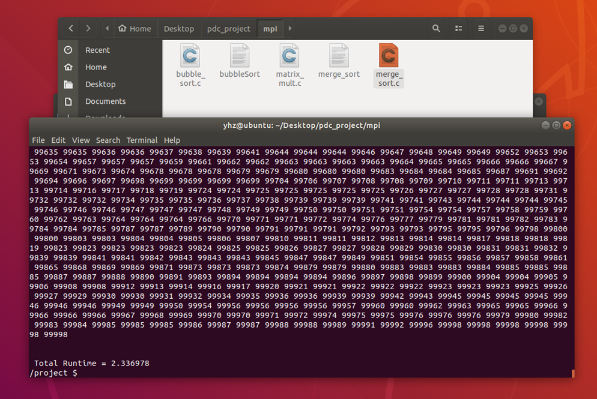
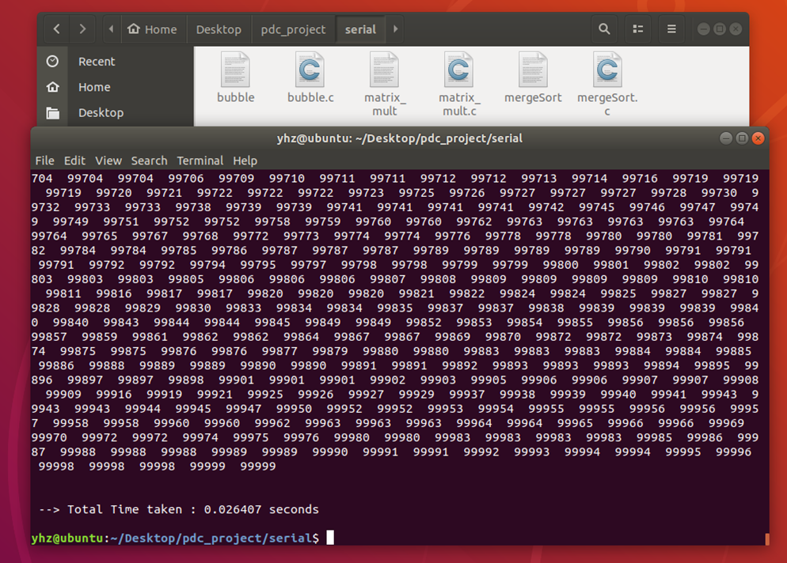
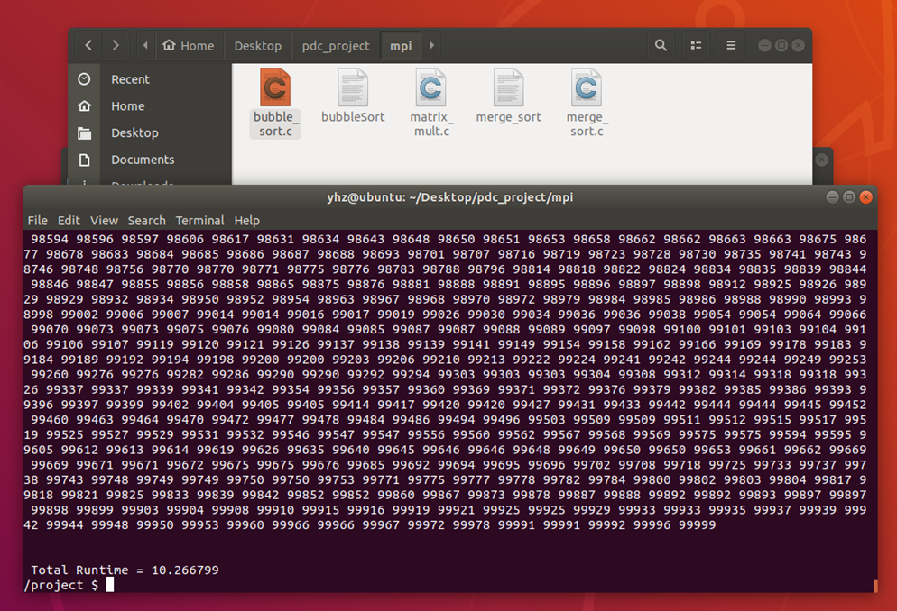
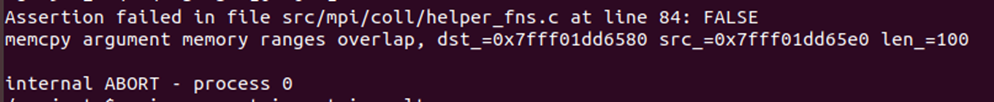
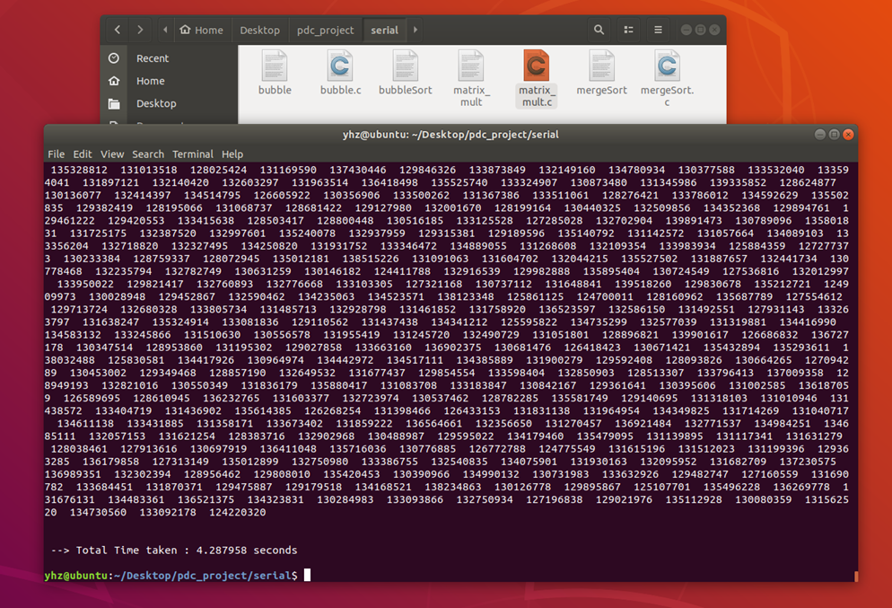

# PDC_Project
	Running Sorting Algorithms in Parallel using MPI inside Docker Container

By Yasir Hussain

## Objective

	This project demonstrates the difference between a sequential and parallel execution of a program 
	and How much it makes a difference. We have compared both MPI and Serial implementation 
	of the following three algorithms:

1) Merge Sort   
2) Bubble Sort   
3) NxN Matrix Multiplication.

## Introduction

	In this project we executed MPI program in Docker environment. Docker allows us to to deploy, 
	distribute applications with all its dependencies independent of local hardware. 
	We can pull images of such containers from Docker Hub website.

	1)	Software Used for Virtualization : VMware Player
	2)	Operating System used : Ubuntu
	3)	Docker Image used : Alpine Linux ( cuz its minimal and lightweight )

## Algorithms

1. <b> Merge Sort </b> is the best example and demonstration of how MPI works. 
How master and slave process distribute work and communicate. 
We divide list into sublists. Each slave process works on the sublists, 
in the end master process gathers the results and merge them.
	
2. <b> Bubble Sort </b> is famous for having the worse time complexity and 
the amount of iterations it takes for large input set of size N it takes N-1 iterations. 
We wanted to test if MPI implementation would make any difference or not.

3. <b> 2D Matrix Multiplication </b> is crucial in solving many real life problems specially related to 
computer science field such as networks, solving linear equations, population modeling and much more. 
GPU solves all complex mathematical equations in form of matrices.

* Initialized Docker Image and Used Alpine Linux terminal having access to files in local folder.

## Results

* ### Merge Sort

	1)	MPI

	--> At Input Size = 100000

2)	Serial

	--> At Input Size = 100000

### Bubble Sort

1)	MPI
	--> At Input Size = 100000

2)	Serial
	--> At Input Size = 100000

### 2D Matrix Multiplication

1)	MPI

	--> At N = 8 , 8 x 8 = 64

	--> At Input > 10 it was giving an error , was unable to show calculated time.

2)	Serial

	--> At N = 800 , NxN = 800 x 800 = 640000  

## Conclusion

	Sometimes sequential algorithm performs better because of small input data set. 
	In such case using MPI causes overhead and loses its purpose. 
	In situations where MPI is ideal to use then sequential algorithms 
	don’t even come close to the performance of MPI.

